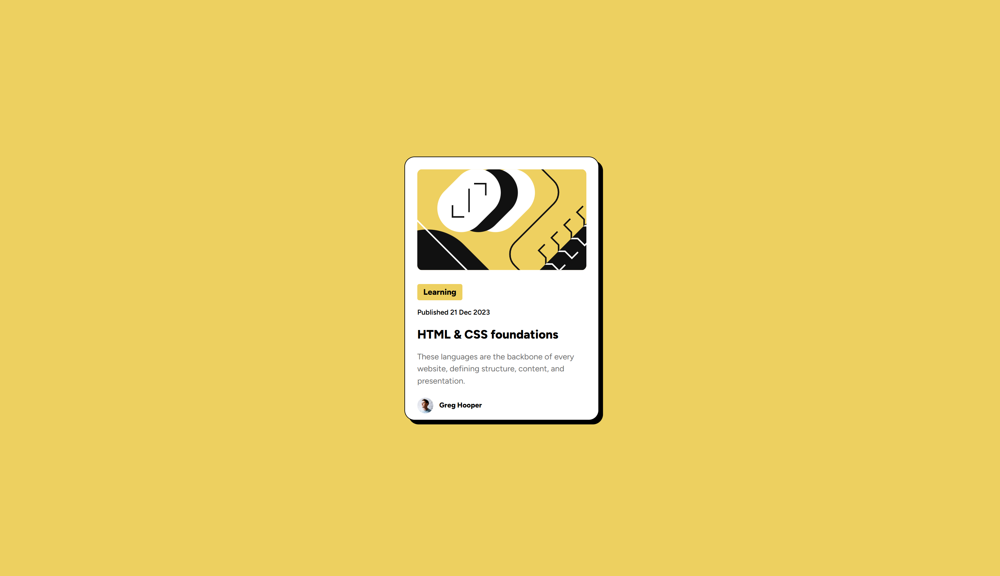

## Table of contents

- [Overview](#overview)
  - [Screenshot](#screenshot)
  - [Links](#links)
- [My process](#my-process)
  - [Built with](#built-with)
  - [What I learned](#what-i-learned)
- [Author](#author)

## Overview

This project is a simple blog preview card built using html and css showcasing hover functionality. CSS used includes flex-box and shadow styling.

### Screenshot

### Links

- Live Site URL: (https://blog-preview-card-main-alpha-five.vercel.app/)

## My process

Approach:
To ensure the design was clean and responsive across all screen sizes, I used Flexbox for layout and alignment. Flexbox provided an efficient way to center the content both vertically and horizontally, making the card adaptable to various screen sizes without requiring absolute positioning or manual adjustments.

Why Flexbox?
Flexbox is perfect for this project because:

It simplifies the process of centering elements on the page.
It allows dynamic resizing of the card and its content, ensuring responsiveness without complex calculations.
It’s intuitive and requires minimal code compared to alternative methods like grid or absolute positioning.

### Built with

- Semantic HTML5 markup
- Flexbox

### What I learned

I learned that using max-width and max-height allows the browser to limit the size to the given value but also keeps the ratio correctly.

## Author

- Website - [Rodel Advincula](https://blog-preview-card-main-alpha-five.vercel.app/)
